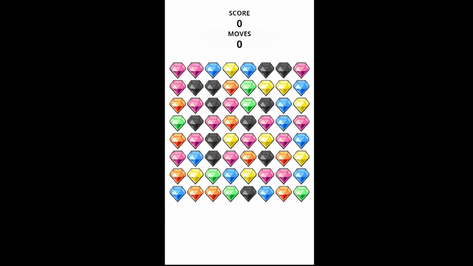

# Match3 Game Example

A simple Match3 puzzle game example built with Cocos Creator 3.8.6 and TypeScript.

## English

### Overview
This is a basic Match3 game implementation demonstrating:
- Tile swapping mechanics
- Match detection algorithms
- Board refilling system
- Audio management
- Touch input handling

### Features
- **Core Match3 Logic** - Swap tiles to create matches of 3+
- **Smooth Animations** - Tile movement and destruction effects
- **Audio System** - Sound effects for tile interactions
- **Responsive Design** - Works on mobile and desktop

### How to Play
1. Tap and drag tiles to swap them
2. Create horizontal/vertical lines of 3+ matching tiles
3. Watch tiles disappear and new ones fall
4. Try to get the highest score!

### Technical Stack
- **Engine**: Cocos Creator 3.8.6
- **Language**: TypeScript
- **Architecture**: Component-based
- **Audio**: Built-in AudioSource system

---

## 中文

### 概述
这是一个基础的三消游戏实现，展示了：
- 方块交换机制
- 匹配检测算法
- 棋盘填充系统
- 音频管理
- 触摸输入处理

### 功能特色
- **核心三消逻辑** - 交换方块创建3个以上匹配
- **流畅动画** - 方块移动和消除特效
- **音频系统** - 方块交互音效
- **响应式设计** - 支持移动端和桌面端

### 游戏玩法
1. 点击并拖拽方块进行交换
2. 创建3个以上相同方块的横向或纵向连线
3. 观看方块消失，新方块落下
4. 努力获得最高分数！

### 技术栈
- **引擎**: Cocos Creator 3.8.6
- **语言**: TypeScript
- **架构**: 基于组件
- **音频**: 内置 AudioSource 系统
